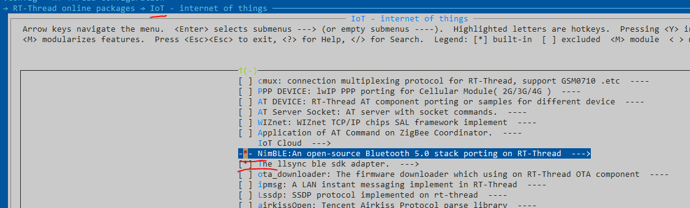

# LLSync_sdk_adapter
sdk for llsync support on bt stack 
porting from https://github.com/tencentyun/qcloud-iot-explorer-BLE-sdk-embedded-demo

Now the llsync package support the feature:

- support the rt-thread/bsp/nrf5x in nimble
- support the rt-thread


## (RT-THREAD)HOW TO USE IT

git clone rt-thread master:

```
git clone https://github.com/RT-Thread/rt-thread.git
```

enter the bsp/nrf5x/nrf52832/ 

```
menuconfig
```

select this package in menuconfig



this package must use the nimble bluetooth stack. 

then use the command download the package

```
pkgs --update
```

then build the mdk5 project

```
scons --target=mdk5
```

then build burn it with keil project

enter the shell

the cmd ble_services_add , will start the ble sample

```

msh >ble_services_add
[I/nimble] GAP procedure initiated: stop advertising.
[I/nimble] GAP procedure initiated: stop advertising.
[I/nimble] ===ble_advertising_stop==197=====
[I/nimble] GAP procedure initiated: advertise; disc_mode=2 adv_channel_map=0 own_addr_type=0 adv_filter_policy=0 adv_itvl_min=0 adv_itvl_max=0
qiot info: start wait advertising
msh >[I/nimble] connection established; status=0, handle:1
[I/nimble] subscribe event; cur_notify=1
 value handle; val_handle=7
[I/nimble] ===gatt_svr_chr_access_q_device_info==58====
[I/nimble] ===ble_send_notify==204==len:14==notify_conn_handle:1=
[I/nimble] GATT procedure initiated: notify; att_handle=7
[I/nimble] ===ble_send_notify==204==len:9==notify_conn_handle:1=
[I/nimble] GATT procedure initiated: notify; att_handle=7
[I/nimble] ===gatt_svr_chr_access_q_device_info==58====
[I/nimble] subscribe event; cur_notify=0
 value handle; val_handle=7
[I/nimble] disconnect; reason=531

```

then , use the wechat (lianlian ) to config the ble device

you can control the led light with your wechat.